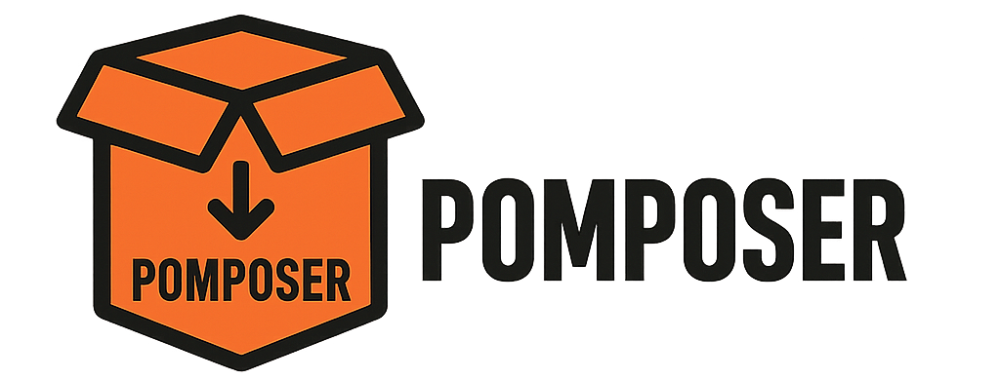

# Pomposer - A Smarter Composer Wrapper (pnpm-style for PHP)

A blazing-fast, cache-aware Composer wrapper that shares packages globally between PHP projects — inspired by `pnpm`.



## Why Pomposer?

Composer is the backbone of modern PHP development, but it's not optimized for shared storage.
Every `composer install` duplicates packages per project, eating up disk space and time.

**Pomposer** brings the best of `pnpm` to PHP:

- 📦 **Global Package Store**: Each package version is downloaded and stored *only once*.
- ⚡ **Faster Installs**: Once a package is in the global store, installs are nearly instant.
- ⚙️ **Advanced Autoloader**: Generates a complete, optimized autoloader (PSR-4, classmap, files).
- 🤝 **Framework Compatibility**: Creates the necessary manifests (`installed.json`, etc.) for features like Laravel's package auto-discovery.
- 📜 **Script Execution**: Correctly runs `post-install-cmd` and `post-autoload-dump` scripts.

---

## How It Works

1.  **Read `composer.lock`** (or falls back to `composer.json` with its own resolver).
2.  **Download and cache packages** to the global store at `~/.pomposer-store`.
3.  **Read the full `composer.json` from within each package** to gather all metadata (autoloading rules, scripts, and framework providers).
4.  **Generate a complete vendor directory**, including:
    - An optimized classmap and PSR-4 autoloader pointing to the global store.
    - The full package manifest (`installed.json`, `installed.php`, etc.) for framework compatibility.
    - Compatibility stubs for Composer's internal classes.
5.  **Execute post-install scripts** to finalize the installation (e.g., `php artisan package:discover`).

---

## Installation

You can install Pomposer globally or locally via Composer:

```bash
composer global require hichemtab-tech/pomposer
```

Make sure Composer global bin is in your `$PATH`. Then run:

```bash
pomposer install
```

---

## Example 1: Build a small Project with Pomposer

Let’s test Pomposer using a simple PHP app that:

* Uses `monolog/monolog` for logging
* Uses your custom package `hichemtab-tech/namecrement`
* Has its own PSR-4 autoloading

---

### 1. Create your test project

```bash
mkdir test-pomposer && cd test-pomposer
```

### 2. Create a `composer.json`:

```json
{
  "name": "hichemtab-tech/test-pomposer",
  "autoload": {
    "psr-4": {
      "HichemTabTech\\TestPomposer\\": "src/"
    }
  },
  "authors": [
    {
      "name": "HichemTab-tech",
      "email": "konanhichemsinshi@gmail.com"
    }
  ],
  "require": {
    "hichemtab-tech/namecrement": "^1.1",
    "monolog/monolog": "^3.9"
  }
}
```

### 3. Create your source and test files

```bash
mkdir src
touch src/index.php
```

Then edit `src/index.php`:

```php
<?php

require_once __DIR__ . '/../vendor/autoload.php';

use HichemTabTech\Namecrement\Namecrement;
use Monolog\Logger;
use Monolog\Handler\StreamHandler;

$existing = ['file', 'file (1)', 'file (2)'];
$newName = Namecrement::namecrement('file', $existing);

echo "Next unique file name after the list of existing files:\n";
echo "Existing files: " . implode(', ', $existing) . "\n";
echo "New file name: ";
echo $newName . "\n\n";

$log = new Logger('test');
$log->pushHandler(new StreamHandler('php://stdout', Logger::DEBUG));
$log->info('Pomposer is alive!');
```

### 4. Run Pomposer

```bash
pomposer install
```

It will:

* Resolve dependencies (even if no `composer.lock`)
* Download and cache each package version in `~/.pomposer-store`
* Link the necessary packages into your `vendor/` folder
* Generate a working autoloader

### 5. Run the test script

```bash
php src/index.php
```

✅ You should see output like:

```
Next unique file name after the list of existing files:
Existing files: file, file (1), file (2)
New file name: file (3)

[2025-07-06 20:31:22] test.INFO: Pomposer is alive! []
```

✅ You just installed `monolog/monolog` without Composer touching your `vendor/` at all.

## Example: Building a Real Laravel App with Pomposer

We have adapted Pomposer to install and run a modern Laravel application.
This process served as a practical test of its ability to handle complex dependencies, package auto-discovery, and post-install scripting.

### 1. Create a Laravel Project

First, create a standard Laravel project with a starter kit like Breeze.

#### using Laravel Installer

```bash
# Example using Laravel Breeze with React & SSR
laravel new pomposer-test-app --breeze --stack react --ssr
cd pomposer-test-app
```
#### or using LaravelFS Installer

```bash
laravelfs new pomposer-test-app --breeze --stack react --ssr
cd pomposer-test-app
```


### 2. Remove Existing Vendor Directory

We want to install from scratch using only Pomposer.

```bash
rm -rf vendor composer.lock
```

### 3. Run Pomposer

Now, tell Pomposer to handle the installation.

```bash
pomposer install
```

Pomposer will resolve dependencies, use its global cache, generate the autoloader and package manifests, and correctly run php artisan package:discover as part of its script execution.

### 4. Verify It Works

Once the installation is complete, you can run standard Artisan commands. The application is ready to go.

```bash
php artisan about
```

You will see a complete list of environment details and discovered packages (like Inertia), proving that Laravel has booted successfully using the Pomposer-generated vendor directory.

## Global Store Layout

Packages are stored by name + version:

```
└── ~/.pomposer-store/
    ├── hichemtab-tech
    │   └── namecrement
    │       └── 1.1.0
    │           ├── composer.json
    │           └── src
    ├── monolog
    │   └── monolog
    │       └── 3.9.0
    │           ├── composer.json
    │           └── src
    └── psr
        └── log
            └── 3.0.2
                ├── composer.json
                └── src
```

---

## ⚠️ Limitations (Beta Notice)

> [!WARNING]  
> Pomposer is still in **beta** — built as a proof of concept.

Current limitations :

* ❌ ️ **No Symlinking:** Unlike pnpm, Pomposer does not use symlinks. It generates an autoloader that points directly to the global store. This means the `vendor/` directory is mostly empty, which can break tools or build scripts that expect to find physical files there.
* ⚠️ **Basic Dependency Resolver:** The dependency resolver is simple and may fail on complex version constraints. It works best when a `composer.lock` file is present.
* ❌ **No Support for `provide`/`replace`/`conflict`:** These advanced dependency management rules are not implemented.
* ❌ **No Composer Plugin System:** Cannot run Composer plugins.
* ⚠️ **Limited Autoloading:** Does not support the deprecated `psr-0` standard.

---

## 💡 Want to Contribute?

Got ideas or experience with Composer internals? Want to help evolve Pomposer into something production-ready?

👉 **Join the discussion and contribute on GitHub**:
[https://github.com/HichemTab-tech/pomposer/discussions/4](https://github.com/HichemTab-tech/pomposer/discussions/4)

---

## License

MIT © @HichemTab-tech
